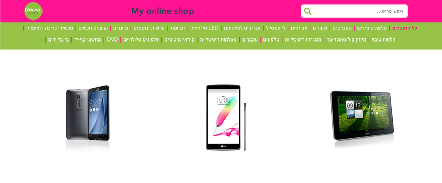
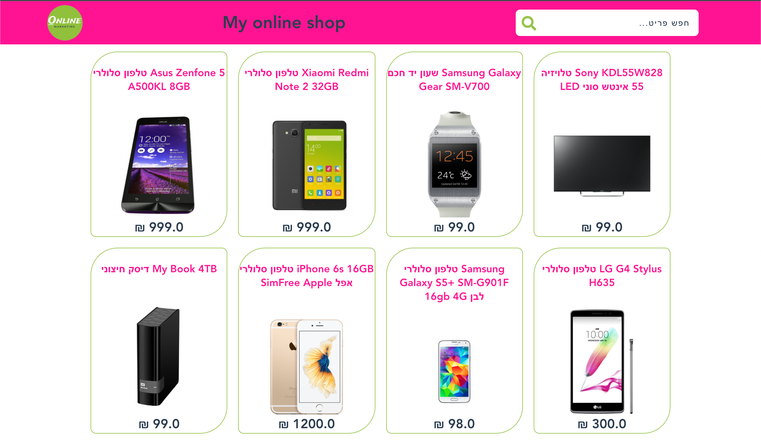
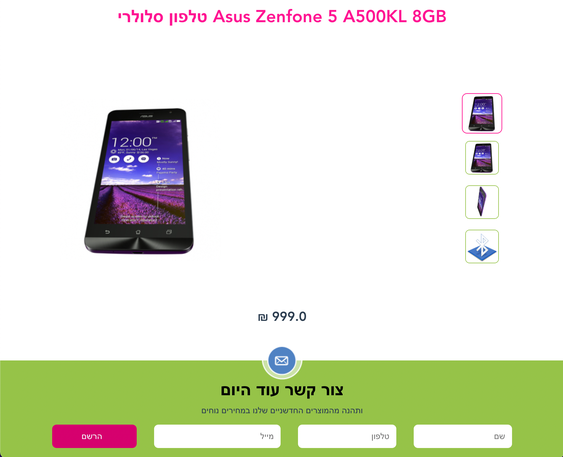
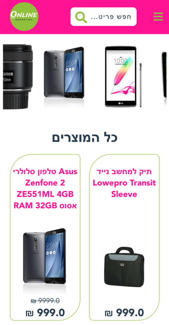

# Online Shop
My first Vue project - an online shop using Konimbo API. There are the Home page includes top bar, categories menu, images carousel and the items area, and also the Item's page includes more info about the item and the footer form to send user's details. 

### Deploy - <a href="https://anaalamed-online-shop.web.app/">link</a>    

### Screenshots

    
    
        
    
    

