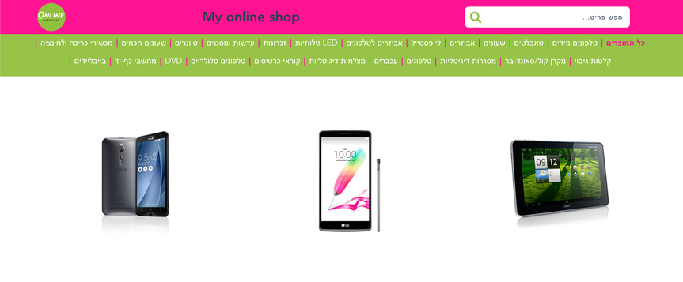
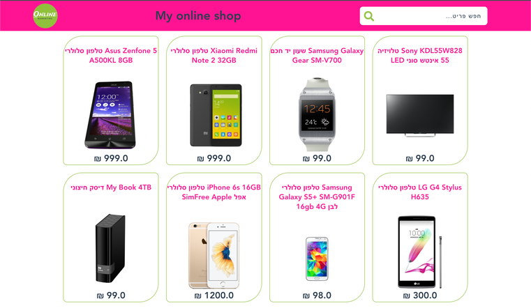
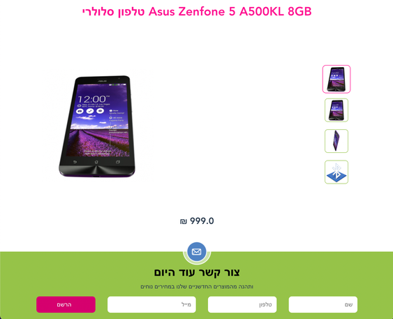
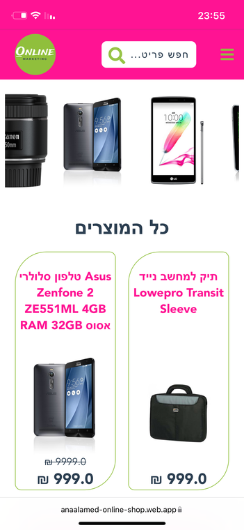

# Online Shop
My first Vue project - an online shop using Konimbo API. There are the home page and item's page.

Deploy - anaalamed-online-shop.web.app

## Screenshots

    
    
        
    
    

